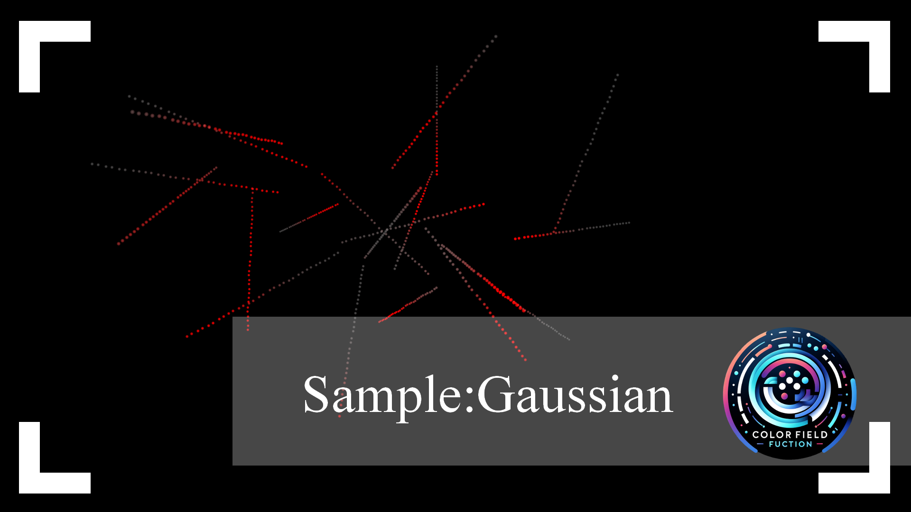

# ColorFieldFunction_System
ColorFieldFunction is a simple and fast solution of setting color light field.

Booth link -> https://appleteaworkshop.booth.pm/items/5371812

### Scripts
* `ObjectContainer.cs`, `SceneChanger.cs`, `LightController.cs`.

## Preview

| Sample_1  | Sample_2  |
|---|---|
|   |   |
|   |   |

## Environment
Unity 2019.4.31f1 LTS
